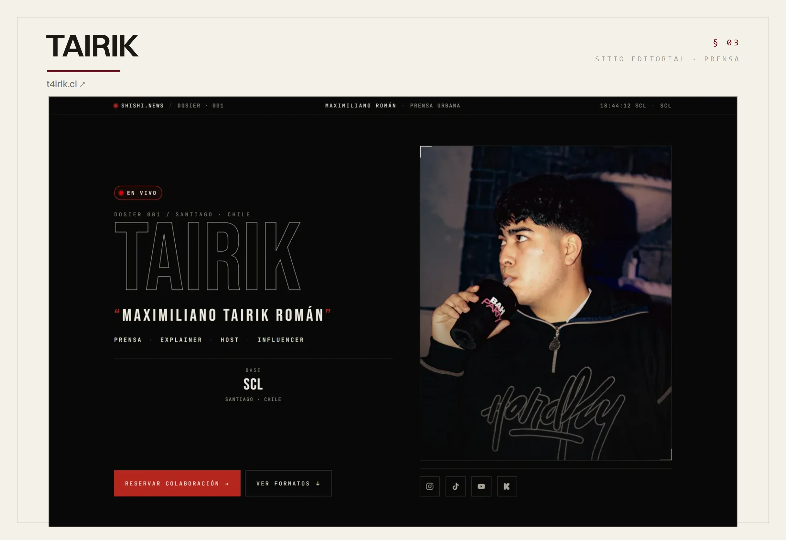
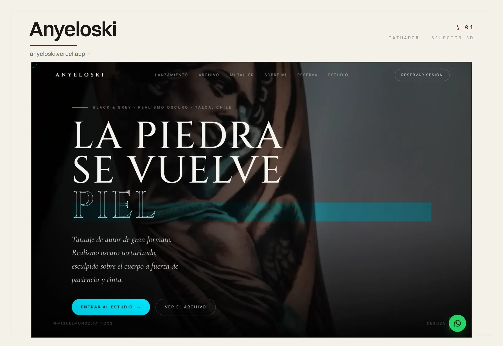
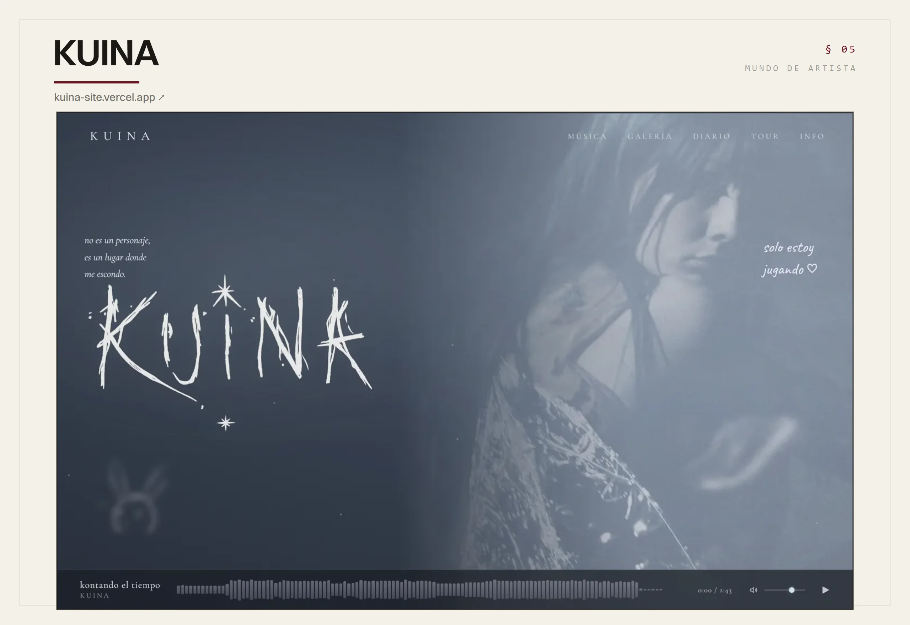
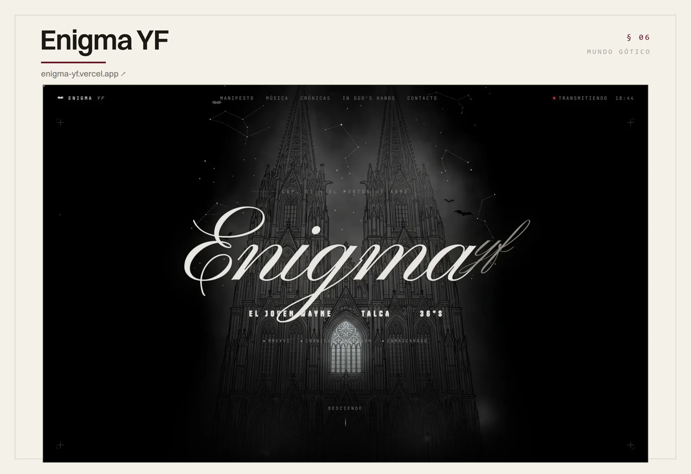

<!-- ─────────────────────────────────────────────────────────────────────────
     Perfil de Matías Olivares Novoa · sistema "Tinta y Hueso"
     Cada sección es un SVG/imagen propio (animaciones SMIL/CSS dentro del SVG).
     ───────────────────────────────────────────────────────────────────────── -->

  

  

  

<table align="center">
  <tr>
    <td width="50%"></td>
    <td width="50%"></td>
  </tr>
  <tr>
    <td width="50%"></td>
    <td width="50%"></td>
  </tr>
</table>

  

  <a href="https://showup.lat">showup.lat</a> &nbsp;·&nbsp;
  <a href="https://www.linkedin.com/in/matiasolivaresnovoa">LinkedIn</a> &nbsp;·&nbsp;
  <a href="mailto:contacto@showup.lat">contacto@showup.lat</a> &nbsp;·&nbsp;
  <a href="https://www.credly.com/users/matias-olivares.9133970a">Credly</a>

