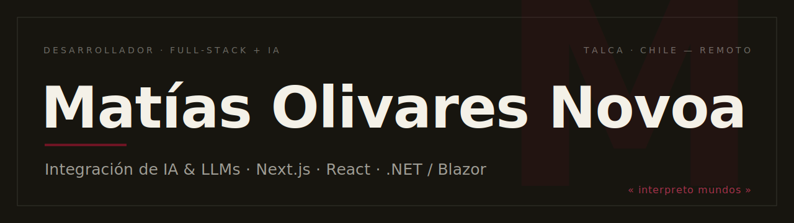
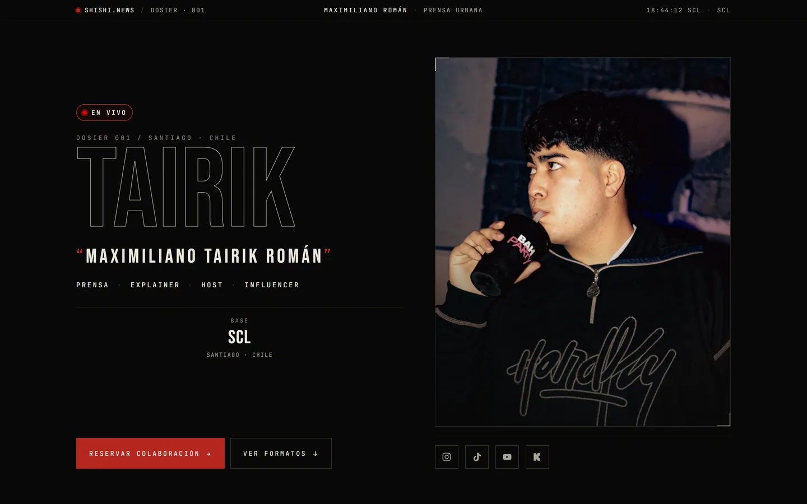
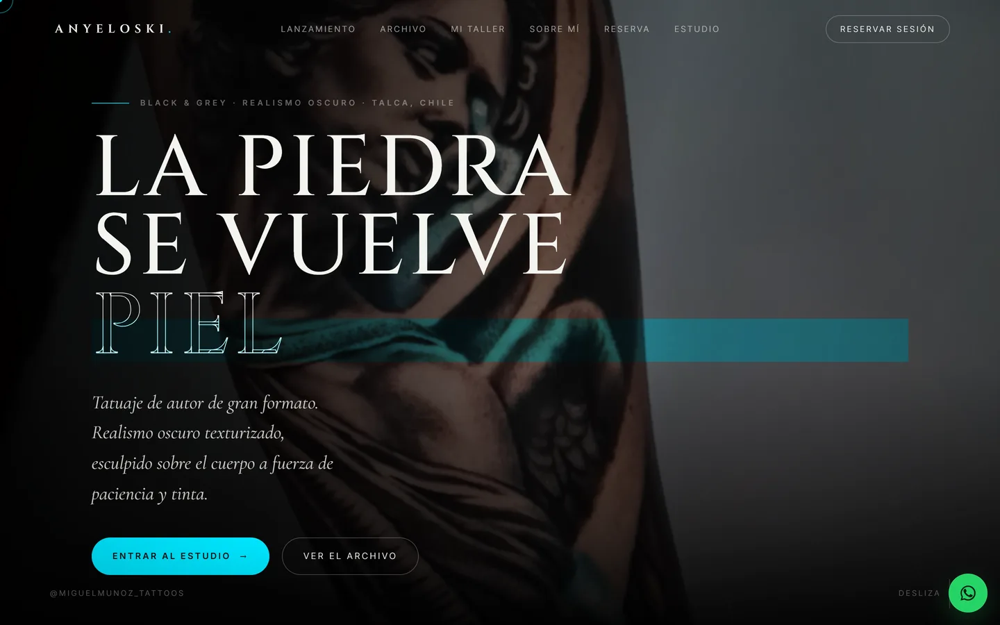
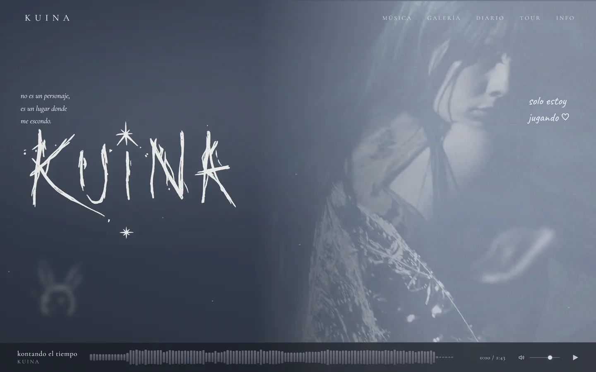

  

  Construyo productos web de extremo a extremo e <b>integro IA donde aporta de verdad</b>. 
  Ingeniero en Informática · fundador del estudio <a href="https://showup.lat"><b>ShowUp</b></a> · Talca, Chile.

  
  
  
  

---

### ⬡ Proyecto destacado · [TailFind](https://github.com/mnovoaa/tailfind)

PWA para **reunir mascotas perdidas con su familia**, con visión por computador e IA de extremo a extremo:
**Google Vision** detecta, un modelo **CLIP** (desplegado en Google Cloud Run) compara la similitud entre fotos,
y **Groq** genera los resúmenes. Todo sobre **Blazor WebAssembly (.NET 8)** + Firebase + Azure.

  
  
  
  
  
  

### ✦ Trabajo seleccionado

Sitios a medida, sin plantillas, para artistas y marcas — vía [ShowUp](https://showup.lat).

<table>
  <tr>
    <td width="50%" valign="top">
      
      
<b>TAIRIK</b> — sitio editorial · <a href="https://t4irik.cl">t4irik.cl</a>

    </td>
    <td width="50%" valign="top">
      
      
<b>Anyeloski</b> — tatuador · selector 3D · <a href="https://anyeloski.vercel.app">en vivo</a>

    </td>
  </tr>
  <tr>
    <td width="50%" valign="top">
      
      
<b>KUINA</b> — mundo de artista · <a href="https://kuina-site.vercel.app">en vivo</a>

    </td>
    <td width="50%" valign="top">
      
      
<b>Enigma YF</b> — mundo gótico · <a href="https://enigma-yf.vercel.app">en vivo</a>

    </td>
  </tr>
</table>

### ✶ Stack

  
  
  
  
  
  
  
   
  
  
  
  
  
  

### ✷ Actividad

  
  

 

  <i>« interpreto mundos » — Talca, Chile · disponible para reubicación y trabajo remoto</i>

